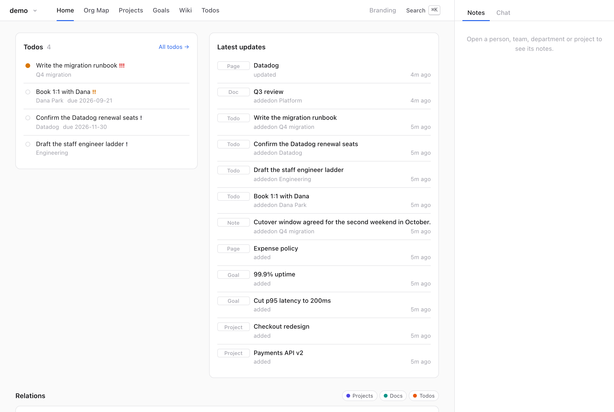
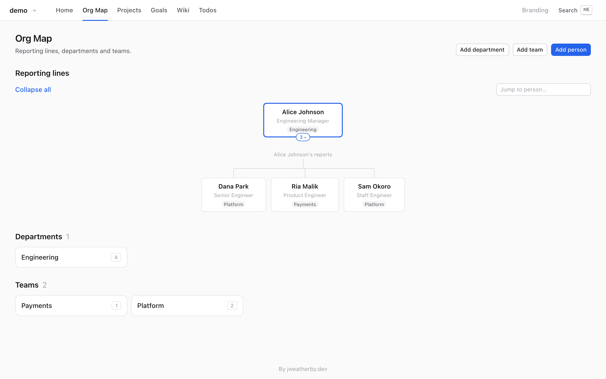
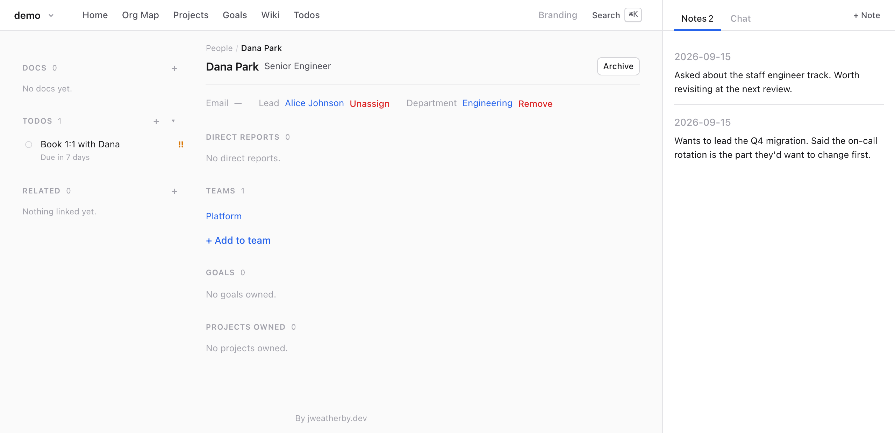
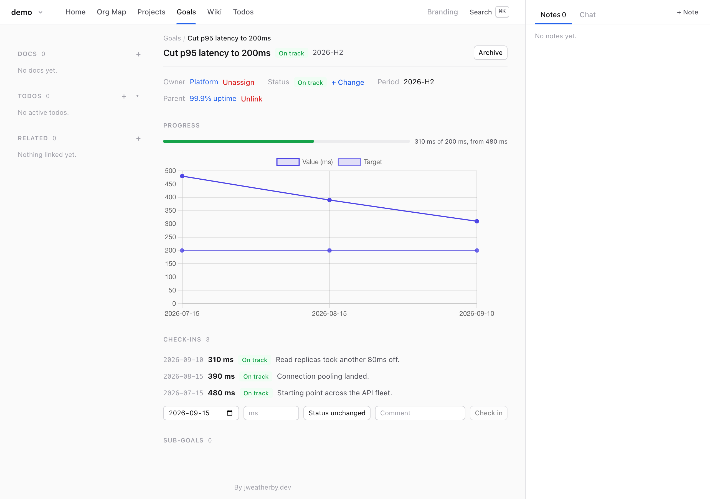
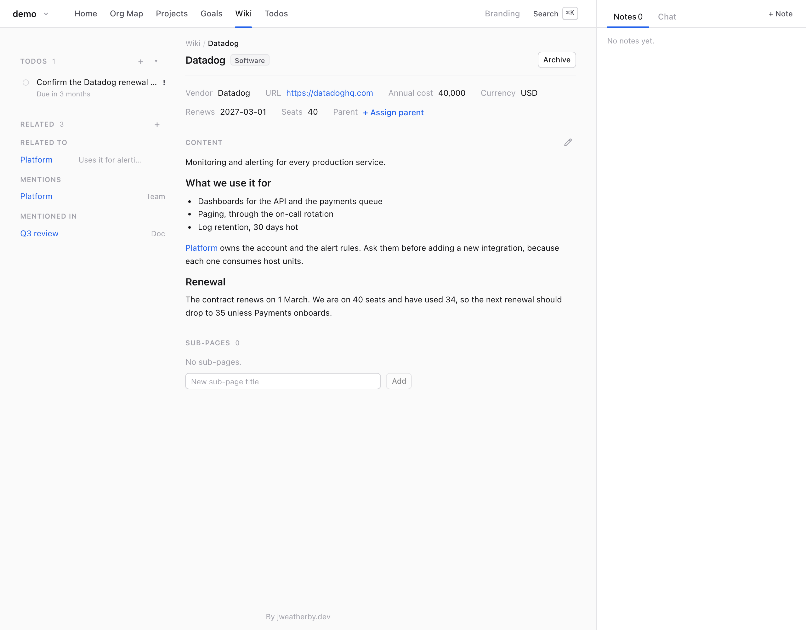
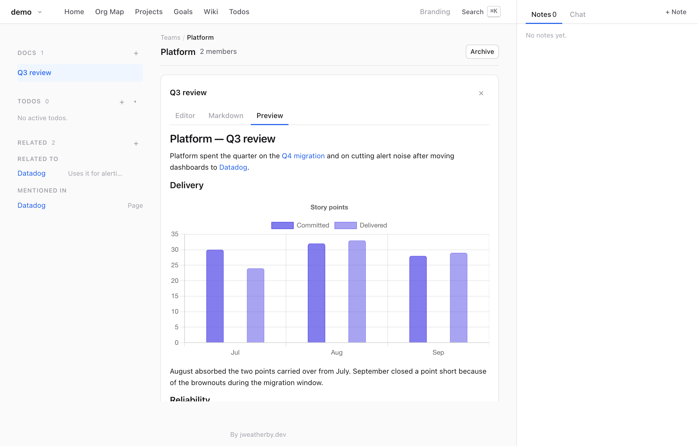

# Working Notes

Working Notes keeps the things you would otherwise carry in your head: who reports to whom, which
team owns which project, where a goal stands this month, why you chose that vendor, and what you
said you would follow up on.

You put things in by telling Claude. You read them in a web app that runs on your own machine.



## Why it exists

Notes about an organisation go stale because keeping them current is filing, and filing is work
nobody does. Working Notes gives the filing to Claude and keeps the structure that made it worth
doing.

**Claude is the input method.** "Dana moved from Platform to Payments" is a sentence you would
say anyway. Claude turns it into the two calls that move the membership. It reaches the notebook
through a command-line tool, `wnotes`, or through a matching MCP server — the standard way Claude
connects to a local program. Both run the same checks the web app runs, and both work while the app
is closed. There is no form to fill in.

**Structure, not a pile of markdown files.** A person has a manager, a project has an owner, a goal
has check-ins with dates and values. That structure is what turns "what do I know about Dana?" and
"what depends on the payments API?" into questions with answers, rather than searches through
text.

**Your data stays on your machine.** Working Notes stores each notebook in a SQLite database in
your application data folder. The server listens on 127.0.0.1 only and refuses any request that did
not come from this computer. There are no accounts, no API keys, no telemetry and no sync. The app
never calls a language model itself: the two features that need one run your own `claude`
command-line tool, and neither is available outside the web app.

**Notebooks are separate databases.** Your job and your side project cannot see each other, and
nothing links across them.

## What it holds

| | |
|---|---|
| **People, teams, departments** | reporting lines, one department each, many teams |
| **Projects** | an owner, a status, sub-projects, three-point estimates |
| **Goals** | a target and a unit, a period like `2026-H2`, sub-goals, and check-ins over time |
| **Wiki pages** | policies, products, software, decisions — each kind with its own typed fields |
| **Relations** | a link between any two of them: related, or one depends on the other |

Notes, docs, todos, links and tags attach to any of them.

You can archive anything, or delete it. Archiving keeps the entity and its history, but removes it
from every list and makes it read-only. Deleting removes everything attached to it as well, so
Claude offers to archive whenever you ask it to delete.

## What using it looks like

### An org change

> **You:** Dana Park joined as a senior engineer, on Platform, reporting to Alice.

```bash
wnotes person.create --name "Dana Park" --title "Senior Engineer"
wnotes person.update --id <dana> --leadId <alice>
wnotes team.addMember --teamId <platform> --personId <dana>
```

Claude runs these for you. In the examples below, `<dana>` and `<platform>` stand for the ids
Working Notes assigns; Claude looks them up before it writes.



You can also edit the org map directly. Reshaping a reorganization is the one job that is faster by
hand than by conversation.

### After a 1:1

> **You:** Note that Dana wants to lead the migration — said the on-call rotation is the part
> they'd change first. Remind me to book a 1:1.

```bash
wnotes note.add --entityType PERSON --entityId <dana> --content "Wants to lead the Q4 migration…"
wnotes todo.create --title "Book 1:1 with Dana" --entityType PERSON --entityId <dana> --priority 2
```



A note keeps your words, with the date, and Claude does not summarise it. Ask "what do I know about
Dana?" months later and Claude reads back the notes, todos, docs and goals attached to that
person.

### A goal, checked in on

> **You:** Platform's H2 goal is p95 latency under 200ms, from 480. We're at 310 now — read
> replicas took another 80ms off.

```bash
wnotes goal.create --title "Cut p95 latency to 200ms" --ownerType TEAM --ownerId <platform> \
  --period 2026-H2 --unit ms --baseline 480 --target 200
wnotes goal.checkIn --goalId <goal> --value 310 --status ON_TRACK --comment "Read replicas…"
```



A check-in adds to a timeline instead of overwriting a single number, so the chart is the history.
Progress is calculated correctly when a lower number is better, as here.

### The wiki, and links between things

> **You:** We pay Datadog $40k a year for 40 seats; it renews in March. Platform uses it for
> alerting.

```bash
wnotes page.create --title Datadog --kind SOFTWARE \
  --properties '{"vendor":"Datadog","annualCost":40000,"currency":"USD","renewalDate":"2027-03-01","seats":40}'
wnotes relation.add --fromType TEAM --fromId <platform> --toType PAGE --toId <datadog> \
  --note "Uses it for alerting"
```



A `SOFTWARE` page takes a vendor, a cost and a renewal date. A `POLICY` page takes a version and
an effective date. Working Notes rejects any other field, so pages of the same kind stay
comparable.

Backlinks come from the content itself. Write `[Q4 migration](/app/projects/<id>)` in a page, doc or
note, and that project gains a "Mentioned in" entry. Links are matched by id, so renaming a thing
never breaks one.

### A write-up, with charts

> **You:** Write up Platform's quarter as a doc — delivery and reliability, with charts.

A chart is a fenced block in the markdown. Working Notes draws it in the notebook's branding colours:

````markdown
```chart
{ "type": "line", "title": "Incidents per month", "labels": ["Jul", "Aug", "Sep"],
  "series": [{ "label": "Incidents", "values": [5, 3, 1] }], "min": 0 }
```
````



On a wiki page, Working Notes checks every chart as it saves, refuses the save if one is wrong, and
names the line — so Claude corrects the block instead of leaving it broken. In a doc, a malformed
chart is simply not drawn.

## The app

The web app is mainly for reading, usually in a browser pane beside Claude.

The home dashboard shows your open todos, a feed of recent changes and a graph of the links between
things. The org map shows reporting lines. Every person, team, project, goal and wiki page gets its
own page, with that entity's docs, todos and relations in the sidebar, and its notes in the right
panel.

Press ⌘K to search. Start the query with `/` to limit it to one kind, as in `/person dana` or
`/project checkout`.

Each entity page also has a **Chat** tab for asking about what is on screen. It runs your own
`claude` command-line tool with no tools of its own, and saves nothing.

## Backups

Working Notes snapshots each notebook every hour, but only when something changed. A snapshot is a
consistent copy of the database and the notebook's files, and it hard-links any file that has not
changed since the last one. Restoring checks the snapshot first, and snapshots your current data
before it overwrites anything, so a restore can itself be undone.

```bash
wnotes backup install                        # the hourly LaunchAgent (macOS)
wnotes backup --force --reason "before the reorg"
wnotes backup list
```

Snapshots stay on this disk, so they do not protect you against losing the disk itself. Time Machine
does, and it backs up the folder they live in automatically.

## Getting started

- **[docs/INSTALL.md](docs/INSTALL.md)** — install the plugin for Claude Code, Cowork or Claude
  desktop Chat. A release includes the app, so there's no clone and no Bun to install.
- **[docs/CLI.md](docs/CLI.md)** — the `wnotes` CLI and MCP server: procedures, notebooks,
  relations, archiving, the chart format, backups.
- **[docs/DEVELOPMENT.md](docs/DEVELOPMENT.md)** — running from a clone, the commands, the plugin
  and the release process.
- **[CLAUDE.md](CLAUDE.md)** — conventions and architecture, for working on the code.

## Status

Working Notes is one person's tool, developed in the open. Expect it to change.

Reports — branded markdown with charts, printed to PDF — are built but turned off behind a feature
flag while they are unfinished. Write-ups go in docs instead.

Releases are built for Apple silicon. Everything except the hourly backup agent, which uses macOS
launchd, also runs on Linux.
